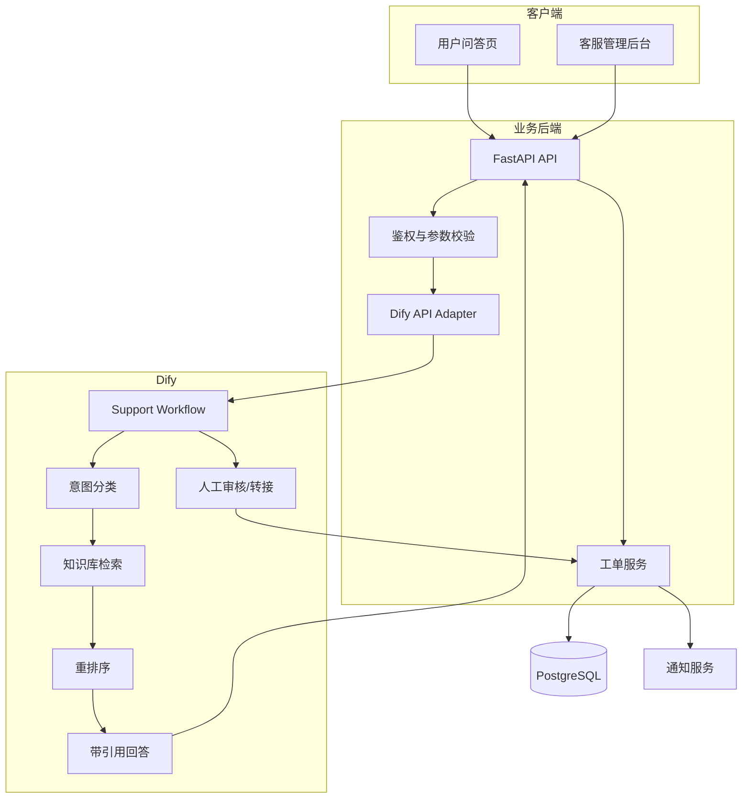

# 系统架构说明

## 1. 总体架构



## 2. 请求数据流

1. 用户向 FastAPI 提交问题。
2. FastAPI 校验用户身份、消息长度和幂等请求 ID。
3. Dify Workflow 判断问题意图和风险级别。
4. Workflow 从企业知识库检索候选文档。
5. 对候选文档进行重排序和阈值过滤。
6. 如果存在足够依据，生成带来源的回复。
7. 如果没有足够依据或属于高风险问题，创建工单并转人工。
8. FastAPI 保存问答、来源、工单和运行指标。
9. 前端展示答案、来源和工单编号。

## 3. 模块职责

### FastAPI

- 对外提供稳定的业务 API。
- 不把 Dify API Key 暴露给浏览器。
- 统一处理鉴权、超时、重试和错误格式。
- 保存业务数据和审计记录。

### Dify Workflow

- 处理意图分类、知识检索和答案生成。
- 通过条件分支决定自动回复还是转人工。
- 输出固定 JSON 结构，避免后端依赖自然语言解析。

### PostgreSQL

- 保存 tickets、feedbacks、conversation_logs 和 workflow_runs。
- 记录每次请求的状态、耗时和错误信息。
- 为后台统计提供查询基础。

## 4. Dify 输出契约

Workflow 应该输出以下字段：

```json
{
  "answer": "string",
  "intent": "account_problem",
  "priority": "medium",
  "confidence": 0.0,
  "need_human": false,
  "reason": "string",
  "sources": [
    {
      "title": "string",
      "section": "string",
      "page": 1,
      "score": 0.0
    }
  ]
}
```

## 5. 状态流转

```text
open → in_progress → resolved → closed
  │          │            │
  └──────────┴────────────┴──→ reopened
```

- `open`：已创建，等待处理。
- `in_progress`：客服正在处理。
- `resolved`：已给出解决方案，等待用户确认。
- `closed`：用户确认或超时关闭。
- `reopened`：用户对解决方案不满意，重新进入处理队列。

## 6. 失败处理

| 场景 | 处理方式 |
|---|---|
| Dify 超时 | 重试一次，仍失败则创建待人工处理工单 |
| 知识库无命中 | 不生成确定性答案，转人工 |
| 模型输出格式错误 | 后端校验失败，记录原始结果并转人工 |
| 数据库不可用 | 返回统一错误，不丢失请求 ID |
| 重复请求 | 使用幂等键返回原结果 |
| 高风险问题 | 禁止自动执行，只允许建议和人工审核 |
